  
  
  
  

<h3 align="center">Stack</h3>

<h3 align="center">Projects</h3>

  
    <a href="https://github.com/azmain-arnob/CSE299-PROJECT-Travelmate-BD---Regional-Tourism-Chatbot-">Travelmate BD repo</a>
    &nbsp;·&nbsp;
    <b>Thesis</b> — instance-aware object removal and background reconstruction
    (<code>YOLOv8</code> + <code>SAM</code> + <code>LaMa</code>), with a residual-aware metric that
    re-detects objects in the reconstructed image to measure how complete a removal really is.
  

<h3 align="center">GitHub, live</h3>

<h3 align="center">Every commit is a brick</h3>

  Dhaka, Bangladesh &nbsp;·&nbsp; open to entry-level software engineering roles

