  
  
  
  

<h3 align="center">Stack</h3>

  
  
  
  
  

  
  
  
  
  
  

  
  
  
  
  
  
  

  
  
  
  

<h3 align="center">Projects</h3>

<table>
<tr>
<td width="50%" valign="top">

**LabDesk** &nbsp;·&nbsp; CSE 499 capstone

LAN classroom and lab management for Windows. An Electron client paired with an
embedded Express and Socket.IO server, peer-to-peer screen streaming over WebRTC,
and an exam-lockdown mode that restores a safe state every time.

`Electron` `Socket.IO` `WebRTC` `Express` `SQLite`

</td>
<td width="50%" valign="top">

**HAMS** &nbsp;·&nbsp; CSE 411, Advanced Databases

Hospital appointment system for patients, doctors and administrators. bcrypt-hashed
sessions on every protected route, and a booking engine that rejects double-bookings
server-side across the full appointment lifecycle.

`Flask` `MongoDB` `Tailwind` `bcrypt`

</td>
</tr>
<tr>
<td width="50%" valign="top">

**[Travelmate BD](https://github.com/azmain-arnob/CSE299-PROJECT-Travelmate-BD---Regional-Tourism-Chatbot-)** &nbsp;·&nbsp; CSE 299, team of four

Bilingual Bangla and English travel assistant. A locally hosted LLM answers from
uploaded PDF and DOCX files through vector retrieval on sentence-transformer
embeddings, with a tour-budget estimator and a latency monitor alongside.

`Python` `ChromaDB` `Gradio` `Sentence Transformers`

</td>
<td width="50%" valign="top">

**VisionGuard** &nbsp;·&nbsp; CSE 445 &amp; CSE 465

Multi-label retinal disease classification across 45 labels on the RFMiD fundus
dataset under severe class imbalance. The fine-tuned ResNet-50 beat the from-scratch
CNN by roughly five times on macro-F1, with Grad-CAM explainability on top.

`PyTorch` `TensorFlow` `scikit-learn` `Grad-CAM`

</td>
</tr>
</table>

  <b>Undergraduate thesis</b> &nbsp;·&nbsp; Instance-aware object removal and background reconstruction
  (<code>YOLOv8</code> + <code>SAM</code> + <code>LaMa</code>), with a residual-aware metric that re-detects
  objects in the reconstructed image to measure how complete a removal really is.

<h3 align="center">GitHub</h3>

  
  

  

<h3 align="center">Every commit is a brick</h3>

  

  Dhaka, Bangladesh &nbsp;·&nbsp; open to entry-level software engineering roles

