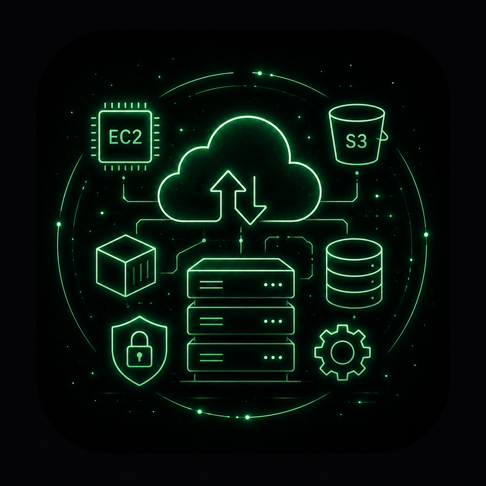
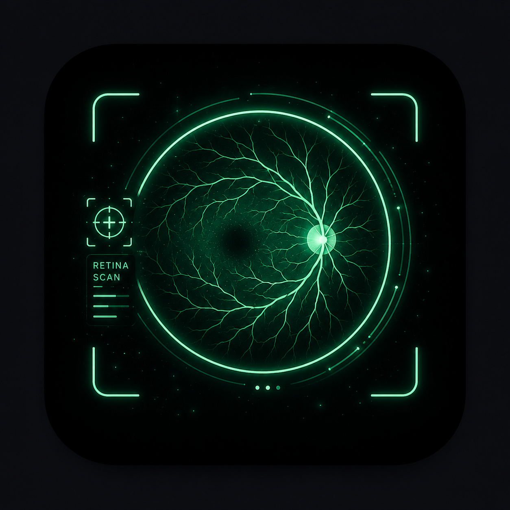

<!--
  Profile README for github.com/azmain-arnob   (repo name must be: azmain-arnob)
  Everything here is LIVE (auto-updates on its own) EXCEPT the snake,
  which needs the one-time snake.yml GitHub Action.
-->

<!-- ░░ intro entrance gif ░░ -->

<!-- ░░ animated name ░░ -->

`Aspiring Software Engineer` · `Cloud & AI Enthusiast` · `Builder · Learner · Dreamer` · `🇧🇩 Dhaka`

 

 

<!-- ░░ live stats + streak (mirror server to dodge rate limits) ░░ -->

 

<!-- ░░ languages + activity graph ░░ -->

 

<!-- ░░ live activity line graph ░░ -->

 

<!-- ░░ dynamic project cards — auto-update from the live repos ░░ -->

<!-- ░░ Featured Projects ░░ -->

# 🚀 Featured Projects

> Building practical software across **Software Engineering**, **Cloud Computing**, and **Artificial Intelligence**.

<table>

<!-- ==================== LabDesk ==================== -->

<tr>
<td width="170" align="center">

</td>

<td>

### 🖥️ LabDesk Agentic AI

Remote desktop management platform for educational computer labs featuring live monitoring, remote control, screen sharing, exam mode, classroom automation, and AI-powered assistance.

**🛠 Tech Stack**  
`Electron` &nbsp; `WebRTC` &nbsp; `Socket.IO` &nbsp; `SQLite`

 

  

> Developed as an academic capstone project. The source code is currently private in accordance with project supervision requirements.

</td>
</tr>

<!-- ==================== Cloud ==================== -->

<tr>
<td width="170" align="center">

</td>

<td>

### ☁️ Cloud Infrastructure Project

Production-ready cloud application focused on scalable deployment, containerization, CI/CD automation, monitoring, and modern cloud architecture.

**🛠 Tech Stack**  
`AWS` &nbsp; `Docker` &nbsp; `GitHub Actions`

 

</td>
</tr>

<!-- ==================== VisionGuard ==================== -->

<tr>
<td width="170" align="center">

</td>

<td>

### 🧠 VisionGuard

Deep learning system for automated retinal disease classification from retinal fundus images using convolutional neural networks.

**🛠 Tech Stack**  
`Python` &nbsp; `TensorFlow` &nbsp; `OpenCV` &nbsp; `CNN`

 

</td>
</tr>

<!-- ==================== Tourism RAG ==================== -->

<tr>
<td width="170" align="center">

</td>

<td>

### 🤖 Tourism RAG Chatbot

Retrieval-Augmented Generation chatbot that helps travellers explore destinations and local information across Bangladesh.

**🛠 Tech Stack**  
`Python` &nbsp; `LangChain` &nbsp; `FAISS` &nbsp; `LLM`

 

</td>
</tr>

<!-- ==================== HAMS ==================== -->

<tr>
<td width="170" align="center">

</td>

<td>

### 🏥 Hospital Management System

Web-based hospital management system for managing patient records, appointments, and administrative workflows.

**🛠 Tech Stack**  
`HTML` &nbsp; `CSS` &nbsp; `JavaScript`

 

</td>
</tr>

</table>

 

<!-- ░░ snake contribution (needs snake.yml action) ░░ -->

