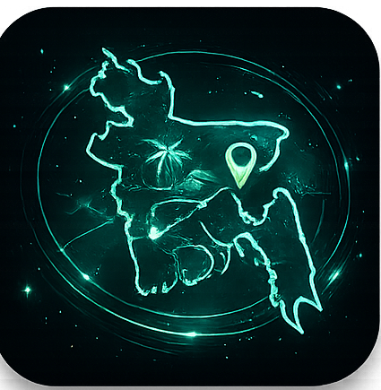

<!--
  Profile README for github.com/azmain-arnob
  Repository name: azmain-arnob
-->

<!-- ░░ intro entrance gif ░░ -->

<!-- ░░ animated name ░░ -->

`Aspiring Software Engineer` · `Cloud & AI Enthusiast` · `Builder · Learner · Dreamer` · `🇧🇩 Dhaka`

 

 

<!-- ░░ GitHub Streak ░░ -->

 

<!-- ░░ Skills & Languages ░░ -->

**Languages**

**Backend · Web · Data**

**AI / ML**

**Cloud · Tools**

 

<!-- ░░ Featured Projects ░░ -->

# Featured Projects

> Building practical software across **Software Engineering**, **Cloud Computing**, and **Artificial Intelligence**.

<table>

<!-- ==================== LabDesk ==================== -->

<tr>

<td width="170" align="center">

</td>

<td>

### LabDesk: Agentic AI Powered Screen Monitoring Software

**🛠 Tech Stack**

`Electron` &nbsp; `WebRTC` &nbsp; `Socket.IO` &nbsp; `SQLite`

 

 

> The source code is currently private in accordance with project supervision requirements.

</td>

</tr>

<!-- ==================== Aether ==================== -->

<tr>

<td width="170" align="center">

</td>

<td>

### Aether: Cloud Infrastructure System

**🛠 Tech Stack**

`AWS` &nbsp; `Docker` &nbsp; `GitHub Actions`

 

</td>

</tr>

<!-- ==================== VisionGuard ==================== -->

<tr>

<td width="170" align="center">

</td>

<td>

### VisionGuard: Fundus Image Disease Detection using ML & DL

**🛠 Tech Stack**

`Python` &nbsp; `TensorFlow` &nbsp; `OpenCV` &nbsp; `CNN`

 

</td>

</tr>

<!-- ==================== TourBot ==================== -->

<tr>

<td width="170" align="center">

</td>

<td>

### TourBot: RAG Based Travel Assistant

**🛠 Tech Stack**

`Python` &nbsp; `LangChain` &nbsp; `FAISS` &nbsp; `LLM`

 

</td>

</tr>

<!-- ==================== HAMS ==================== -->

<tr>

<td width="170" align="center">

</td>

<td>

### HAMS: Hospital Appointment Management System

**🛠 Tech Stack**

`MongoDB` &nbsp; `Node.js` &nbsp; `Express.js` &nbsp; `HTML` &nbsp; `CSS` &nbsp; `JavaScript`

 

</td>

</tr>

</table>

 

<!-- ░░ LeetCode Problem Solving ░░ -->

 

 

<!-- ░░ Contribution Snake ░░ -->

